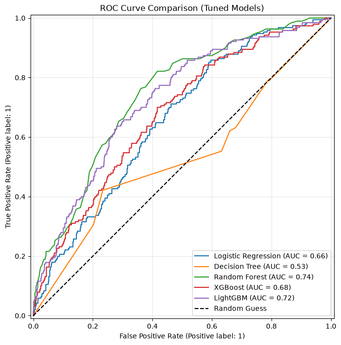
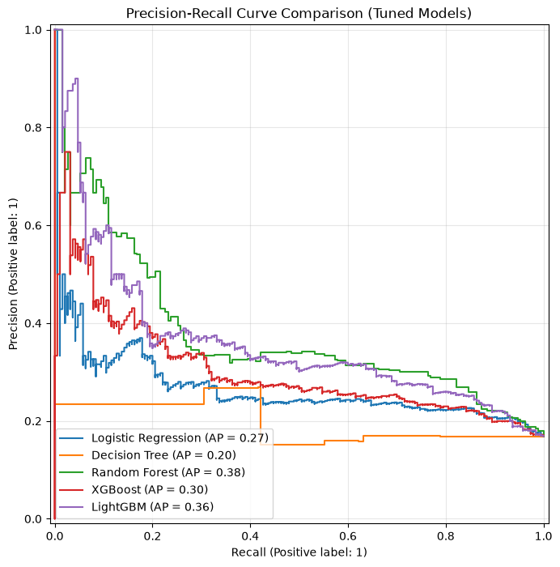
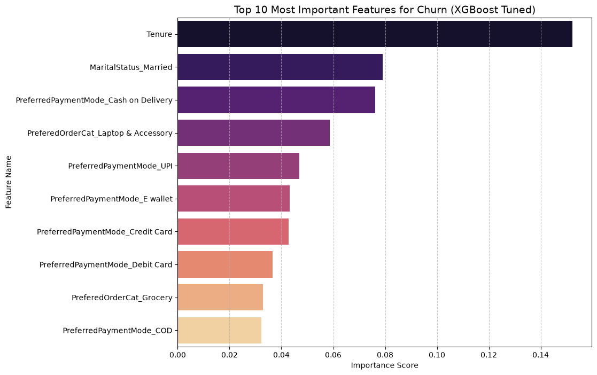

# E-Commerce Customer Churn Analysis & Prediction

This repository contains a complete end-to-end Machine Learning pipeline to predict customer churn for an E-Commerce platform. It encompasses data extraction, preprocessing, hyperparameter tuning of state-of-the-art models, and delivering business insights through an interactive Power BI Dashboard.

## Dataset
The dataset used in this project is sourced from Kaggle:
**[E-commerce Customer Churn Analysis and Prediction](https://www.kaggle.com/datasets/ankitverma2010/ecommerce-customer-churn-analysis-and-prediction)**
*Credits to Ankit Verma for providing this comprehensive dataset.*

## Project Structure
- `notebooks/`: Jupyter Notebooks demonstrating the step-by-step analytical process (EDA, Preprocessing, Modelling, Business Insight).
- `src/`: Production-ready Python scripts containing modularized logic of the pipeline.
- `models/`: Saved `joblib` artifacts of the tuned models (e.g., XGBoost, LightGBM).
- `data/`: Contains raw data, processed training/testing sets, and the final CSV export optimized for Power BI.
- `images/`: Visualizations generated by the machine learning pipeline.
- `dashboard/`: Power BI dashboard file and related assets.

## Machine Learning Results
We trained and evaluated several models including Logistic Regression, Decision Tree, Random Forest, XGBoost, and LightGBM. All models underwent rigorous hyperparameter tuning using `RandomizedSearchCV`.

### 1. ROC-AUC Curve (Tuned Models)
The ROC-AUC curve demonstrates the models' ability to distinguish between retained and churned customers. XGBoost and LightGBM typically achieve the highest AUC scores.

### 2. Precision-Recall Curve (Tuned Models)
Because customer churn is often an imbalanced classification problem, the Precision-Recall curve is a critical metric. It highlights the trade-off between accurately identifying churners (Precision) and capturing as many true churners as possible (Recall).

### 3. Feature Importance (XGBoost)
Understanding *why* a customer churns is as important as the prediction itself. The feature importance chart below (extracted from the tuned XGBoost model) reveals the top drivers of customer churn.

## Business Insights & Power BI Dashboard
The machine learning predictions (Churn Probability & Risk Level) are integrated into a **Power BI Dashboard** to provide actionable business insights, calculate potential revenue at risk, and segment customers for targeted marketing campaigns.

## Getting Started
1. Clone the repository.
2. Install the requirements: `pip install -r requirements.txt`.
3. Rename `config.example.py` to `config.py` and input your local MySQL database credentials.
4. Run the pipeline scripts in the `src/` folder or follow the numbered Jupyter Notebooks.
